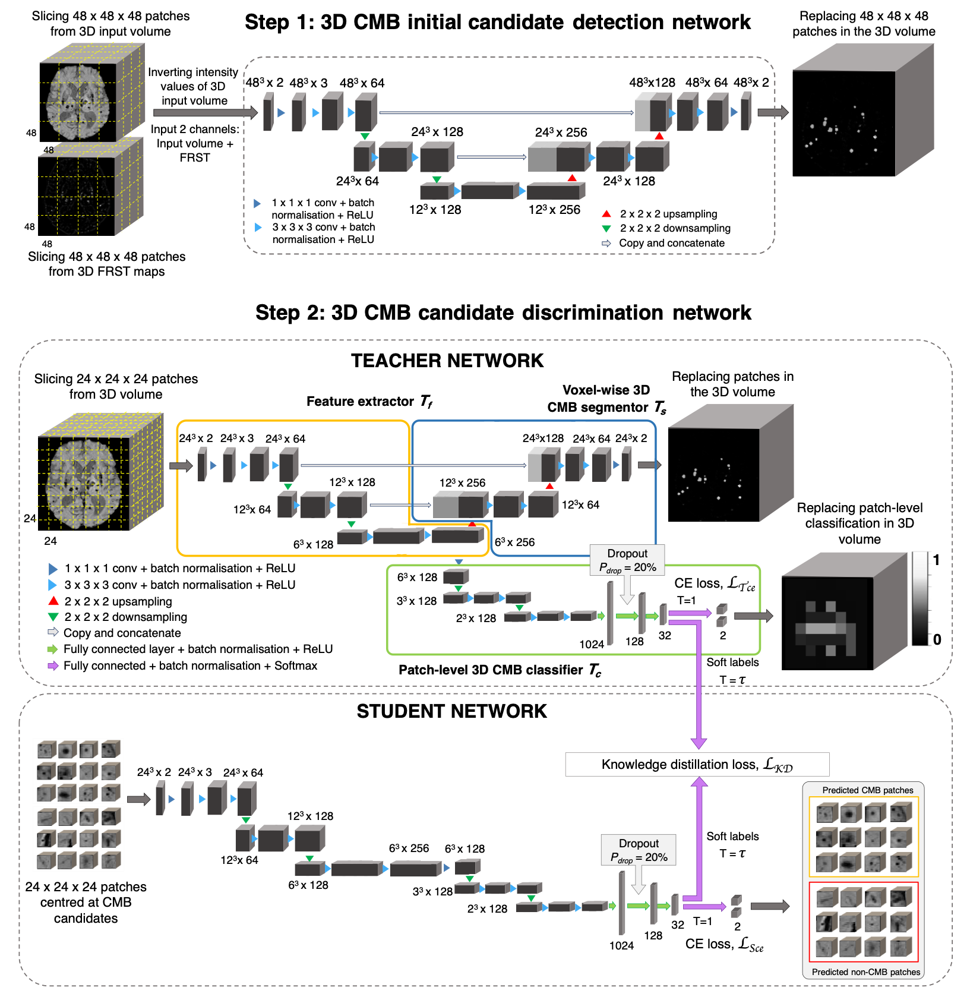

# Automated Detection of Cerebral Microbleeds (CMBs) on MR images using a Knowledge Distillation Framework.

Code for implementing an automated CMB detection tool using candidate
detection and teacher-student candidate discrimination.

This is a beta release of the code for CMB detection. For any issues please contact: vaanathi@iisc.ac.in

## Citation

If you use MicrobleedNet, please cite the following papers:

* Sundaresan, Vaanathi, Christoph Arthofer, Giovanna Zamboni, Andrew G.
   Murchison, Robert A. Dineen, Peter M. Rothwell, Dorothee P. Auer et al.
   "Automated detection of cerebral microbleeds on MR images using knowledge
   distillation framework." Frontiers in Neuroinformatics 17 (2023).
   [DOI: 10.3389/fninf.2023.1204186](https://doi.org/10.3389/fninf.2023.1204186)
* Sundaresan, Vaanathi, Christoph Arthofer, Giovanna Zamboni, Robert A. Dineen,
   Peter M. Rothwell, Stamatios N. Sotiropoulos, Dorothee P. Auer et al.
   "Automated detection of candidate subjects with cerebral microbleeds using
   machine learning." Frontiers in Neuroinformatics 15 (2022): 777828.
   [DOI: 10.3389/fninf.2021.777828](https://doi.org/10.3389/fninf.2021.777828)

## Method



Initial candidate detection uses both intensity characteristics and the radial
symmetry of CMBs. Its objective combines weighted cross-entropy and Dice losses.
Candidate discrimination uses a teacher-student framework to classify true CMB
candidates among false positives. The teacher model has three parts:

* Feature extractor
* Voxel-wise CMB segmentor
* Patch-level CMB classifier

The student model contains the teacher's feature extractor and patch-level
classifier and is trained offline using response-based knowledge distillation.

## Requirements

Install these tools before setting up the project:

* [uv](https://docs.astral.sh/uv/)
* [FSL](https://fsl.fmrib.ox.ac.uk/fsl/docs/) with BET installed

CUDA is optional. The supplied configurations use CPU execution. To use CUDA,
install a compatible PyTorch environment and change `device` and `use_amp` in
the relevant configuration.

Preprocessing requires the `FSLDIR` environment variable to reference the FSL
installation directory. MicrobleedNet checks for the executable at
`FSLDIR/bin/bet`. Configure FSL in the shell that will run the pipeline before
starting preprocessing, inference, or evaluation.

## Set up after cloning

1. Enter the cloned repository directory:

   ```powershell
   cd microbleed-detection
   ```

2. Install the required Python version through `uv`:

   ```powershell
   uv python install 3.13
   ```

3. Create the locked project environment and install all dependency groups:

   ```powershell
   uv sync --frozen --all-groups
   ```

4. Verify that the CLI starts:

   ```powershell
   uv run microbleednet --help
   ```

5. Verify FSL before running a command that preprocesses images:

   ```powershell
   Test-Path (Join-Path $env:FSLDIR "bin/bet")
   ```

   The command should return `True`. On Linux or WSL, use the corresponding
   shell command to verify `$FSLDIR/bin/bet`.

## Prepare data and configuration

Organize each source as one NIfTI volume per subject. Training and evaluation
also need one matching mask per subject. The supplied `index-data` example
expects this layout:

```text
data/
  raw/
      volumes/
         subject-001.nii.gz
         subject-002.nii.gz
      masks/
         subject-001.nii.gz
         subject-002.nii.gz
```

Filename patterns use `{subject_id}` to capture the stable part of each
subject's path. `index-data` prefixes the captured value with `source_id`, which
allows one indexed dataset to contain multiple cohorts without subject-ID
collisions.

Complete TOML examples live in the [`configs`](configs) directory. Each file is
named after the command that consumes it, and the commands below use those
files directly. Update the example paths and settings for your environment.
Use `uv run microbleednet describe COMMAND` to inspect accepted configuration
keys, defaults, and field descriptions. Use
`uv run microbleednet COMMAND --help` for an operational summary and the
required `--config` option.

## Run the training workflow

### Index data

Index the raw paths and metadata into the dataset manifest:

```powershell
uv run microbleednet index-data --config configs/index-data.toml
```

Run `index-data` once for each source that should be merged into the dataset.
Each source needs a unique `source_id` and its own configuration file. To
replace an existing source, rebuild the dataset in a new or empty directory.

### Preprocess subjects

Preprocess the indexed subjects and persist the image, mask, and FRST variants:

```powershell
uv run microbleednet preprocess --config configs/preprocess.toml
```

The preprocessing augmentation factor must be at least as large as the factors
requested by training. Set `resume = true` only when continuing an incomplete
preprocessing run with the same inputs and settings.

### Split subjects

Create the train, validation, and held-out test assignments:

```powershell
uv run microbleednet split --config configs/split.toml
```

The three proportions must total `1.0`. Set a seed when the split must be
reproducible.

### Train models

Train the detector, discriminator teacher, and discriminator student stages:

```powershell
uv run microbleednet train --config configs/train.toml
```

Training materializes stage-specific patches and writes latest and best
checkpoints. Set `resume = true` only to continue an incomplete training run
that still has a latest checkpoint or a completed prior stage.

## Run inference and evaluation

After training, choose the workflow that matches your goal.

### Evaluate the held-out experiment split

The supplied evaluation configuration derives the detector and student
checkpoints from `experiment_dir`. It runs inference on the held-out test split
and then scores the source-space detections against the raw reference masks:

```powershell
uv run microbleednet evaluate --config configs/evaluate.toml
```

You do not need to run the standalone `infer` command before experiment
evaluation.

Evaluation can instead use checkpoint files supplied by the user. Remove
`experiment_dir` and provide `output_dir`, `detector_checkpoint_path`, and
`student_checkpoint_path`, as shown in
[`configs/evaluate-explicit.toml`](configs/evaluate-explicit.toml). The files
must use the project checkpoint format. Each `model_state_dict` entry must be
compatible with its detector or student model class as defined in this
repository.

### Infer an indexed dataset

Use explicit checkpoint paths to process every subject in an indexed raw
dataset:

```powershell
uv run microbleednet infer --config configs/infer.toml
```

The checkpoints may come from another training run or be supplied by the user.
They must use the project checkpoint format, with `model_state_dict` entries
compatible with `CandidateDetector` and `CandidateDiscriminatorStudent` as
defined in this repository. Update `detector_checkpoint_path` and
`student_checkpoint_path` in the inference configuration before running the
command.

Inference preprocesses each subject, applies the detector and student models,
filters candidate components, and restores the final binary detection mask to
the source image shape and affine.

`evaluate` also supports explicit checkpoint paths instead of an experiment
directory. Run `uv run microbleednet describe evaluate` for that configuration
contract.

> [!IMPORTANT]
> Global logging flags must appear before the command name. Place `--verbose`
> or `--quiet` immediately after `microbleednet`, as shown below.

```powershell
uv run microbleednet --verbose train --config configs/train.toml
uv run microbleednet --quiet infer --config configs/infer.toml
```

## Outputs and manifests

Paths below use the directories from the supplied configurations.

| Stage         | Primary outputs                                                                                                      |
|---------------|----------------------------------------------------------------------------------------------------------------------|
| Indexing      | `data/indexed/manifests/raw.json`                                                                                     |
| Preprocessing | `data/indexed/preprocessed/{volumes,masks,frst}/` and `data/indexed/manifests/preprocessed.json`                    |
| Splitting     | `experiments/default/manifests/split.json`                                                                            |
| Training      | `experiments/default/train/<stage>/patches/`, checkpoints, stage manifests, and `manifests/train.json`              |
| Inference     | `<output_dir>/infer/<subject_id>/detections.nii.gz` and `<output_dir>/manifests/infer.json`                           |
| Evaluation    | `<output_dir>/manifests/evaluate.json` plus the inference outputs scored by the run                                  |

Manifests record lifecycle status, source paths, parameters, subject membership,
and content fingerprints. Downstream commands use those fingerprints to reject
stale or mismatched artifacts.

> [!IMPORTANT]
> Do not edit manifests manually. They are pipeline-owned provenance records.
> If inputs or settings change, rerun the command that owns the manifest and
> regenerate dependent outputs.

## Development checks

Run the configured quality gates from the repository root:

```powershell
uv run ruff check .
uv run pyright
uv run pytest
```

The test configuration requires 100 percent statement and branch coverage.